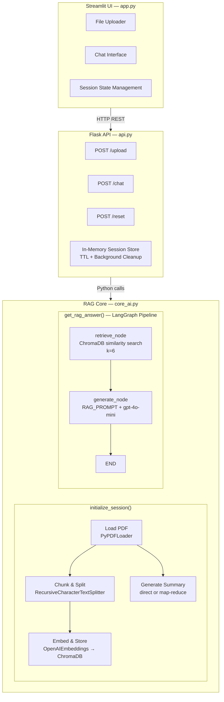
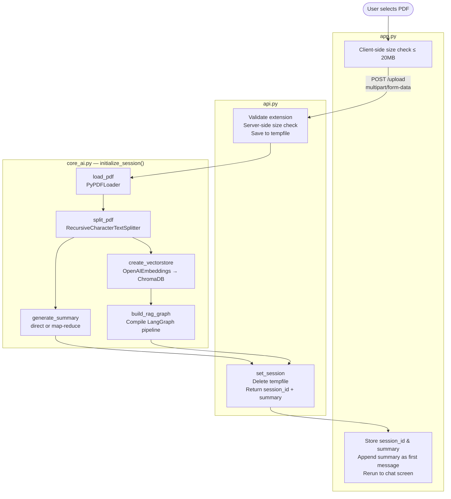
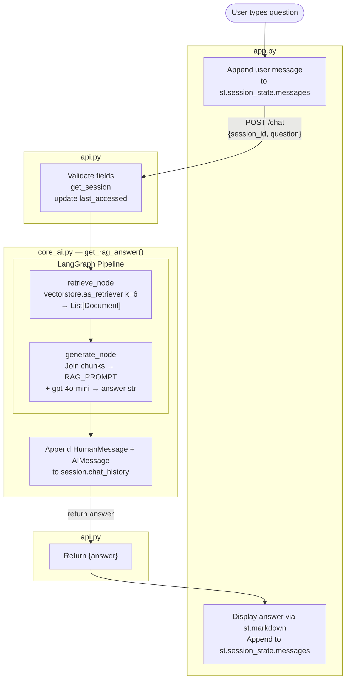

# PDF RAG Chatbot

A Retrieval-Augmented Generation (RAG) chatbot that lets you upload a PDF document and have a contextual question-answering conversation about its contents. The system automatically generates a document summary on upload and answers all subsequent questions strictly from the document's content.

Built with LangChain, LangGraph, OpenAI, ChromaDB, Flask, and Streamlit.

---

## Table of Contents

- [Features](#features)
- [Architecture Overview](#architecture-overview)
- [Tech Stack](#tech-stack)
- [Project Structure](#project-structure)
- [Prerequisites](#prerequisites)
- [Setup](#setup)
- [Running the App](#running-the-app)
- [API Reference](#api-reference)
- [Codebase Documentation](#codebase-documentation)
  - [core\_ai.py](#core_aipy)
  - [api.py](#apipy)
  - [app.py](#apppy)
- [Data Flow](#data-flow)
- [Configuration Reference](#configuration-reference)
- [Limitations](#limitations)

---

## Features

- **PDF Upload & Processing** — Upload any PDF up to 20MB; text is extracted, chunked, and embedded automatically
- **Automatic Summarization** — Generates a concise, high-level document summary on upload; uses map-reduce for documents exceeding the single-context limit
- **Contextual Q&A** — Ask natural language questions answered strictly from document content; the model will not draw on external knowledge
- **Conversation History** — Chat history is maintained per session and passed to the RAG pipeline on every turn
- **Isolated Sessions** — Each upload creates a fully isolated session with its own vector store collection and chat history
- **Automatic Session Expiry** — Sessions expire after 15 minutes of inactivity and their resources (including ChromaDB collections) are freed automatically by a background thread
- **Modular Architecture** — AI logic, REST API, and frontend UI are fully decoupled into separate modules

---

## Architecture Overview



---

## Tech Stack

| Layer | Technology | Version |
|---|---|---|
| LLM | OpenAI `gpt-4o-mini` | — |
| Embeddings | OpenAI `text-embedding-ada-002` | — |
| RAG Orchestration | LangChain | 1.2.7 |
| Pipeline Graph | LangGraph | 1.0.7 |
| Vector Store | ChromaDB | 1.4.1 |
| PDF Loading | PyPDF (via LangChain) | 6.6.2 |
| Token Counting | tiktoken | 0.12.0 |
| Backend API | Flask + Waitress | 3.1.2 / 3.0.2 |
| Frontend UI | Streamlit | 1.53.1 |
| Environment Config | python-dotenv | 1.2.1 |

---

## Project Structure

```
chatbot/
├── src/
│   ├── core_ai.py       # All AI logic: PDF processing, summarization, RAG pipeline
│   ├── api.py           # Flask REST API, session store, background cleanup
│   └── app.py           # Streamlit frontend UI
├── requirements.txt     # Python dependencies (pinned)
├── .env                 # Environment variables — not committed
├── .gitignore
└── .venv/               # Virtual environment — not committed
```

---

## Prerequisites

- Python 3.10+
- An [OpenAI API key](https://platform.openai.com/account/api-keys)

---

## Setup

### 1. Clone the repository

```bash
git clone <repository-url>
cd chatbot
```

### 2. Create and activate a virtual environment

```bash
python -m venv .venv

# macOS / Linux
source .venv/bin/activate

# Windows
.venv\Scripts\activate
```

### 3. Install dependencies

```bash
pip install -r requirements.txt
```

### 4. Configure environment variables

Create a `.env` file in the project root:

```env
OPENAI_API_KEY=your_openai_api_key_here
```

---

## Running the App

Both the backend API and the frontend UI must be running simultaneously in separate terminals.

### Terminal 1 — Start the backend API

```bash
python src/api.py
```

The API server (Waitress) starts on `http://localhost:8000`.

### Terminal 2 — Start the frontend UI

```bash
streamlit run src/app.py
```

The Streamlit UI starts on `http://localhost:8501`. Open your browser to this address to use the app.

---

## API Reference

All request and response bodies use `application/json` unless noted.

---

### `POST /upload`

Upload and process a PDF. Creates a new session and returns a session ID and document summary.

**Request:** `multipart/form-data`

| Field | Type | Constraints | Description |
|---|---|---|---|
| `file` | File | PDF only, max 20MB | The PDF to upload |

**Response `200 OK`:**
```json
{
  "session_id": "3f7a1c2d-...",
  "summary": "This document discusses..."
}
```

**Error Responses:**

| Status | Condition |
|---|---|
| `400` | No file in request |
| `400` | File is not a PDF |
| `413` | File exceeds 20MB |
| `500` | PDF processing failed |

---

### `POST /chat`

Submit a question for the active session. Returns an answer grounded in the document.

**Request body:**
```json
{
  "session_id": "3f7a1c2d-...",
  "question": "What are the key findings?"
}
```

| Field | Type | Required | Description |
|---|---|---|---|
| `session_id` | string | Yes | Session ID from `/upload` |
| `question` | string | Yes | Natural language question |

**Response `200 OK`:**
```json
{
  "answer": "The key findings are..."
}
```

**Error Responses:**

| Status | Condition |
|---|---|
| `400` | Missing `question` or `session_id` field |
| `400` | No active session found for `session_id` |
| `500` | RAG pipeline failure |

---

### `POST /reset`

Explicitly terminate a session and free all associated resources (vector store collection, chat history).

**Request body:**
```json
{
  "session_id": "3f7a1c2d-..."
}
```

**Response `200 OK`:**
```json
{
  "status": "reset successful"
}
```

> This endpoint always returns `200` regardless of whether the session existed. It is safe to call multiple times.

---

## Codebase Documentation

### `core_ai.py`

The AI core module. Contains all logic for PDF ingestion, summarization, vector store management, and the LangGraph RAG pipeline. Has no knowledge of HTTP or UI concerns.

---

#### Module-level singletons

```python
_shared_llm = ChatOpenAI(model="gpt-4o-mini", temperature=0, ...)
_shared_embeddings = OpenAIEmbeddings(...)
```

`_shared_llm` and `_shared_embeddings` are instantiated once at module load and shared across all sessions. This avoids the overhead of re-creating API clients per request and ensures connection reuse. `temperature=0` is set on the LLM to produce deterministic, factual answers appropriate for document Q&A.

---

#### `ChatState` (TypedDict)

The state schema for the LangGraph pipeline. Each key is read or written by one or more graph nodes.

```python
class ChatState(TypedDict):
    question: str                                # The user's current question
    context: List[Document]                      # Retrieved chunks from the vector store
    answer: str                                  # The LLM-generated answer
    chat_history: List[HumanMessage | AIMessage] # Full conversation history
```

`ChatState` is a `TypedDict` (not a class instance) to comply with LangGraph's state management requirements — graph nodes receive and return plain dict-like objects.

---

#### `AISession`

A container object that holds all state and resources associated with one user session (one uploaded PDF).

| Attribute | Type | Description |
|---|---|---|
| `pages` | `List[Document]` | Raw pages as loaded by `PyPDFLoader` |
| `documents` | `List[Document]` | Chunked/split documents for embedding |
| `vectorstore` | `Optional[Chroma]` | In-memory ChromaDB collection for this session |
| `summary` | `Optional[str]` | Generated document summary |
| `chat_history` | `List[HumanMessage \| AIMessage]` | Accumulated conversation turns |
| `collection_name` | `str` | Unique ChromaDB collection name (`rag_collection_<8-hex-chars>`) |
| `_llm` | `ChatOpenAI` | Reference to the shared LLM singleton |
| `_embeddings` | `OpenAIEmbeddings` | Reference to the shared embeddings singleton |
| `_rag_graph` | `CompiledGraph` | Compiled LangGraph pipeline for this session |

Each session gets a unique `collection_name` derived from a UUID to prevent ChromaDB collection collisions between concurrent users.

---

#### `load_pdf(pdf_path: str) -> List[Document]`

Loads a PDF from a local file path using LangChain's `PyPDFLoader`. Returns one `Document` object per page, each containing the page text in `page_content` and page metadata (page number, source path) in `metadata`.

```python
pages = load_pdf("/tmp/uploaded.pdf")
# pages[0].page_content → "Introduction\nThis paper..."
# pages[0].metadata     → {"page": 0, "source": "/tmp/uploaded.pdf"}
```

---

#### `split_pdf(pages: List[Document]) -> List[Document]`

Splits the raw page documents into smaller overlapping chunks suitable for embedding and retrieval, using `RecursiveCharacterTextSplitter`.

| Parameter | Value | Rationale |
|---|---|---|
| `chunk_size` | `1000` | Balances context richness per chunk vs. retrieval precision |
| `chunk_overlap` | `250` | 25% overlap prevents answer-relevant text from being cut at a chunk boundary |

The splitter attempts to break on paragraph boundaries first, then sentences, then words, before falling back to character-level splitting — preserving semantic coherence where possible.

---

#### `generate_summary(llm, pages) -> str`

Generates a high-level summary of the full document. Uses one of two strategies depending on document size, determined by counting tokens with `tiktoken` against the `gpt-4o-mini` encoding.

**Strategy 1 — Direct summarization** (documents < 98,000 tokens):

The full text of all pages is concatenated and sent to the LLM in a single prompt. The 98k token threshold provides a safety margin below `gpt-4o-mini`'s 128k context window, accounting for prompt overhead and the response.

**Strategy 2 — Map-Reduce summarization** (documents ≥ 98,000 tokens):

1. **Map phase:** Each page is summarized independently using `MAP_PROMPT`. Pages are processed in parallel batches (`max_concurrency=5`) via LangChain's `.batch()` to minimize latency on large documents.
2. **Reduce phase:** All per-page summaries are concatenated and passed to `COMBINE_PROMPT` to produce a single coherent final summary.

---

#### `create_vectorstore(docs, embeddings, collection_name) -> Chroma`

Creates an in-memory ChromaDB vector store from the chunked documents. Each chunk is embedded via the OpenAI embeddings API and stored under the given `collection_name`. The collection is not persisted to disk — when the session ends, `delete_collection()` is called explicitly to release ChromaDB's internal resources.

---

#### Prompts

**`RAG_PROMPT`** — Used during answer generation. Instructs the model to answer strictly from the provided context and fall back to a fixed message if the answer is absent:

> *"The document does not contain this information."*

This explicitly forbids the model from drawing on its parametric knowledge, preventing hallucination.

**`MAP_PROMPT`** — Used during the map phase of map-reduce summarization. Instructs the model to produce a concise summary of a single document section.

**`COMBINE_PROMPT`** — Used during the reduce phase. Instructs the model to synthesize multiple section summaries into one high-level document summary without adding external information.

---

#### `retrieve_node(state: ChatState, session: AISession) -> ChatState`

The first node in the LangGraph RAG pipeline. Performs a similarity search against the session's ChromaDB vector store using the current question as the query. Retrieves the top **k=6** most semantically similar chunks and writes them into `state["context"]`.

---

#### `generate_node(state: ChatState, session: AISession) -> ChatState`

The second node in the LangGraph RAG pipeline. Concatenates the text of all retrieved chunks into a single `context_text` string, then invokes `RAG_PROMPT | _llm | StrOutputParser()` with the context and question. Writes the answer string into `state["answer"]`.

---

#### `build_rag_graph(session: AISession) -> CompiledGraph`

Constructs and compiles the LangGraph `StateGraph` for a session.

Graph topology:

```
START ──▶ [retrieve] ──▶ [generate] ──▶ END
```

Nodes are registered as lambdas that close over the `session` object, binding session-specific resources (vectorstore, LLM) to otherwise stateless node functions. The compiled graph is stored on `session._rag_graph` and reused for every question in the session's lifetime.

---

#### `get_rag_answer(session: AISession, question: str) -> str`

The main entry point for answering a question. Orchestrates a full RAG pipeline invocation:

1. Constructs an initial `ChatState` with the question, empty context/answer, and the session's accumulated `chat_history`
2. Invokes the compiled LangGraph pipeline via `session._rag_graph.invoke(initial_state)`
3. Extracts the answer from `final_state["answer"]`
4. Appends `HumanMessage(question)` and `AIMessage(answer)` to `session.chat_history` for use in future turns
5. Returns the answer string

> **Note:** While `chat_history` is passed into the graph state and accumulated, the current `retrieve_node` and `generate_node` implementations do not use it. It is present in the state schema to support future history-aware retrieval or multi-turn prompt strategies such as query rewriting based on prior turns.

---

#### `initialize_session(pdf_path: str) -> AISession`

The top-level session factory called by the API on PDF upload. Executes the full ingestion pipeline sequentially:

1. `load_pdf()` — Extract pages from the PDF
2. `split_pdf()` — Chunk pages into overlapping segments
3. `generate_summary()` — Summarize the document (direct or map-reduce)
4. `create_vectorstore()` — Embed chunks and build the ChromaDB collection
5. `build_rag_graph()` — Compile the LangGraph pipeline

Returns a fully initialized `AISession` ready to serve queries.

---

### `api.py`

The Flask REST API layer. Handles HTTP concerns: routing, request validation, file I/O, and session lifecycle. Contains no AI logic — all AI operations are delegated to `core_ai.py`.

---

#### Session Store

Sessions are stored in a module-level dictionary protected by a `threading.Lock`:

```python
_sessions: Dict[str, dict] = {}
# Structure:
# {
#   "<session_id>": {
#     "session": AISession,
#     "last_accessed": float  # Unix timestamp
#   }
# }
```

All reads and writes to `_sessions` are protected by `_sessions_lock` to prevent race conditions under concurrent requests.

---

#### `get_session(session_id: str) -> AISession`

Retrieves an active session by ID and updates `last_accessed` to the current time, effectively resetting the TTL clock on each access. Raises `RuntimeError("No active session found.")` if the ID is not present — this error message is surfaced directly to the API caller as a `400` response.

---

#### `set_session(session_id: str, session: AISession)`

Registers a newly initialized `AISession` in the session store under the given ID, recording the current time as `last_accessed`.

---

#### `_destroy_chroma_collection(session_id: str, session: AISession)`

Performs cleanup for a session's vector store. Calls `session.vectorstore.delete_collection()` to remove the ChromaDB collection from memory, then calls `gc.collect()` to prompt Python's garbage collector. Exceptions during collection deletion are silently swallowed to ensure cleanup never raises and blocks other operations.

---

#### `clear_session(session_id: str)`

Removes a session from the store and destroys its resources. The deletion from `_sessions` and the ChromaDB cleanup are intentionally separated — the lock is held only for the dict mutation, and `_destroy_chroma_collection()` is called after the lock is released. This minimizes lock contention by keeping the potentially slow cleanup operation outside the critical section.

---

#### `cleanup_expired_sessions()`

A background worker that runs in a daemon thread for the lifetime of the process. Every 60 seconds it:

1. Acquires the lock and collects all session IDs where `now - last_accessed > SESSION_TTL_SECONDS`
2. Removes those entries from `_sessions` while still under the lock
3. Releases the lock, then calls `_destroy_chroma_collection()` for each expired session

The thread is started at module load with `daemon=True` so it does not prevent the process from exiting cleanly.

---

#### `POST /upload` handler

1. Validates that a file is present and has a `.pdf` extension
2. Performs a server-side file size check by seeking to the end of the file stream (avoids loading the entire file into memory just for the size check)
3. Saves the uploaded file to a `tempfile` with a `.pdf` suffix
4. Calls `initialize_session(pdf_path)` to run the full ingestion pipeline
5. Generates a UUID as `session_id` and registers the session via `set_session()`
6. Returns `{"session_id": ..., "summary": ...}`
7. Deletes the temporary file in a `finally` block regardless of success or failure

---

#### `POST /chat` handler

1. Validates that both `question` and `session_id` are present in the JSON body
2. Retrieves the session via `get_session()` — raises `RuntimeError` if not found, caught and returned as `400`
3. Calls `get_rag_answer(session, question)` and returns `{"answer": ...}`

---

#### `POST /reset` handler

Calls `clear_session(session_id)` if a `session_id` is provided in the body, then always returns `{"status": "reset successful"}`. The response is unconditional — the endpoint is idempotent and safe to call on already-expired or nonexistent sessions.

---

#### Entry Point

```python
if __name__ == "__main__":
    from waitress import serve
    serve(app, host="0.0.0.0", port=8000)
```

Waitress is used instead of Flask's built-in development server for production-grade WSGI serving — it is multi-threaded, has no debug mode, and is stable under concurrent load.

---

### `app.py`

The Streamlit frontend. Manages two distinct UI states — an upload screen and a chat screen — and communicates with the backend exclusively via HTTP.

---

#### Session State

Streamlit reruns the entire script on every user interaction. `st.session_state` is used to persist values across reruns:

| Key | Type | Description |
|---|---|---|
| `uploaded` | `bool` | Whether a PDF has been successfully uploaded |
| `session_id` | `str \| None` | The backend session ID for the current document |
| `summary` | `str \| None` | The document summary returned from `/upload` |
| `messages` | `List[dict]` | Chat history as `{"role": "user"\|"assistant", "content": str}` |

All keys are initialized on first load with `if "key" not in st.session_state` guards to avoid `KeyError` on reruns.

---

#### `reset_chat()`

Resets the application to its initial state:

1. Calls `POST /reset` on the backend to free server-side resources (errors are silently swallowed to prevent a network failure from locking the UI)
2. Deletes all keys from `st.session_state`
3. Calls `st.rerun()` to re-render the app from scratch, returning to the upload screen

---

#### `upload_pdf(file)`

Sends the selected file to `POST /upload` as `multipart/form-data`. Uses `timeout=None` to permit arbitrarily long processing for large PDFs. Wraps the request in `st.spinner("Processing PDF. Please wait...")` to provide visual feedback. Returns `(session_id, summary)` on success; calls `st.error()` and re-raises on failure.

---

#### `get_answer(question: str) -> str`

Sends the question and current `session_id` to `POST /chat`. Uses `timeout=None` to permit slow RAG responses. Returns the answer string on success; calls `st.error()` and re-raises on failure.

---

#### UI Rendering

**Upload Screen** (`st.session_state.uploaded == False`):
- Renders a file uploader restricted to `.pdf` files
- Performs a client-side file size check (≤ 20MB) before calling the API, providing fast feedback without a round-trip
- On successful upload, sets `uploaded = True`, stores `session_id` and `summary`, and appends the summary as the first assistant message
- Calls `st.rerun()` to transition to the chat screen

**Chat Screen** (`st.session_state.uploaded == True`):
- Renders a "New Chat" button that calls `reset_chat()`
- Replays all messages in `st.session_state.messages` using `st.chat_message` to reconstruct the full conversation display on each rerun
- Renders a `st.chat_input` for new questions
- On submission: appends the user message, calls `get_answer()` inside a `st.spinner("Thinking...")`, displays and appends the assistant response

---

## Data Flow

### Upload Flow



### Chat Flow



---

## Configuration Reference

| Parameter | File | Default | Description |
|---|---|---|---|
| `SESSION_TTL_SECONDS` | `api.py` | `900` | Seconds of inactivity before a session is expired (15 minutes) |
| Cleanup interval | `api.py` | `60s` | How often the background cleanup thread runs |
| Max file size | `api.py` / `app.py` | `20MB` | Maximum PDF upload size, enforced on both client and server |
| `chunk_size` | `core_ai.py` | `1000` | Character count per text chunk |
| `chunk_overlap` | `core_ai.py` | `250` | Character overlap between adjacent chunks |
| `k` (retrieval) | `core_ai.py` | `6` | Number of chunks retrieved per query |
| Token threshold | `core_ai.py` | `98000` | Max tokens before switching to map-reduce summarization |
| `max_concurrency` | `core_ai.py` | `5` | Parallel LLM calls during the map phase of summarization |
| LLM model | `core_ai.py` | `gpt-4o-mini` | OpenAI model used for all generation tasks |
| LLM temperature | `core_ai.py` | `0` | Sampling temperature (0 = deterministic) |
| API host | `api.py` | `0.0.0.0` | Network interface the API server binds to |
| API port | `api.py` | `8000` | Port the API server listens on |
| `API_BASE_URL` | `app.py` | `http://localhost:8000` | Backend URL used by the Streamlit frontend |

---

## Limitations

- **In-memory vector store** — ChromaDB collections are not persisted to disk. All data is lost when the server restarts, and all active sessions are invalidated.
- **Single-document sessions** — Each session is bound to exactly one PDF. There is no facility to add documents to an existing session.
- **No streaming** — Both the API and frontend implement non-streaming responses. Streaming implementations exist in the codebase but are commented out.
- **Chat history unused in retrieval** — `chat_history` is tracked and passed through the pipeline state but is not currently used to rewrite or contextualize queries. Multi-turn questions that rely on prior context (e.g., "tell me more about that") may not retrieve the correct chunks.
- **No authentication** — The API has no authentication layer. Any client with network access can create sessions and query them.
- **Shared LLM client concurrency** — The `_shared_llm` and `_shared_embeddings` singletons are shared across all sessions and threads. Thread safety depends on the underlying OpenAI client; high concurrency may benefit from connection pool tuning.